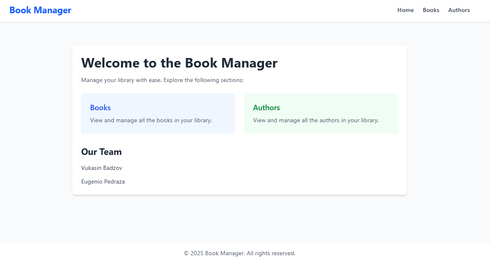
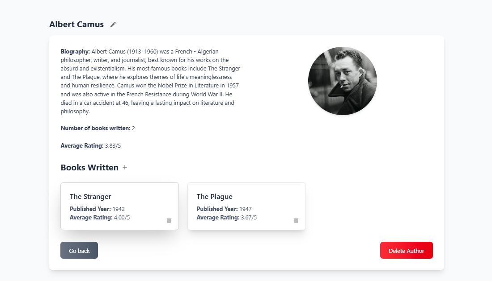
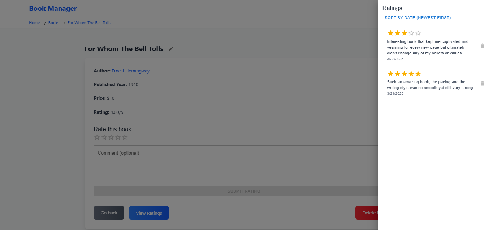

# Library Management System

## 📚 Overview

A full-stack book management system for libraries, built with **NestJS** (backend) and **React/Next.js** (frontend). The app allows users to manage books and authors, featuring search, sorting, ratings, and CRUD operations.

## ✨ Features

### **📖 Books Management**

- View a list of books with title, author, and publication year
- Search and sort books
- Add new books via a modal
- Detailed book pages with:
  - Title, price, and publication year
  - Author details (with link to author page)
  - Rating system (1-5 stars with optional comments)
  - Delete functionality (with confirmation)

### **✍️ Authors Management**

- View a list of authors with name, photo, and book count
- Search authors
- Add new authors via a modal
- Detailed author pages with:
  - Name, photo, and biography
  - List of their books (with links)
  - Edit and delete functionality (with confirmation)

### **🔍 Navigation & UI**

- Responsive layout with a navigation menu
- Breadcrumbs for easy navigation
- Consistent styling with **Tailwind CSS**
- Modals for forms and confirmations

## 📸 Screenshots

### Homepage



### Author Details



### Book Details with Rating



## 🛠️ Tech Stack

### **Frontend**

- React with Next.js
- TypeScript
- Tailwind CSS

### **Backend**

- NestJS
- SQLite (database)
- RESTful API

## 🚀 Getting Started

1. **Clone the repository:**

   ```bash
   git clone https://github.com/Badzov/Junia-Isen-WebTech-Final-Project.git
   ```

2. **Install dependencies:**

   ```bash
   cd m1-site && npm install
   cd ../m1-api && npm install
   ```

3. **Set up the database (SQLite):**

   ```bash
   cd m1-api && npm run migration:run
   ```

4. **Run the app:**
   - Frontend: `npm run dev`
   - Backend: `npm run start:dev`

## 🔧 Development Practices

- **TypeScript** for type safety
- **Functional programming** where possible
- **Clean code structure** (separated components, services, models)
- **Git best practices** (meaningful commits, branch management)

## 📅 Future Improvements

- User authentication (librarian vs. visitor roles)
- Book borrowing/return system
- Advanced filtering (by genre, rating, etc.)
- Dark mode & accessibility enhancements

---

Feel free to explore the code and contribute! 🚀

For questions, open an issue or contact me directly.

Happy reading! 📖✨
